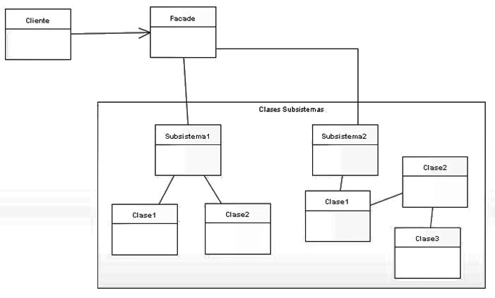
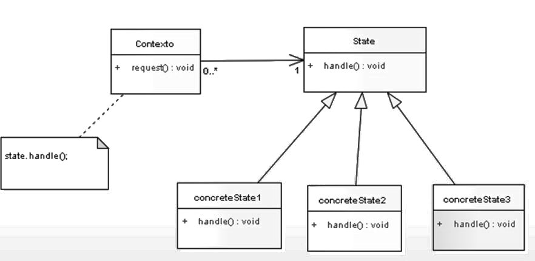

=========
Patrones
=========

.. contents:: Contenidos

Patrón Facade 
==============

**Intención:** Proporcionar una interfaz simplificada para un grupo de subsistemas o un sistema complejo.

**Motivación:** Simplificar el acceso a un conjunto de clases proporcionando una única clase que todos utilizan para comunicarse con dicho conjunto de clases.

Reducir la complejidad y minimizar dependencias

Reduce el acoplamiento entre clientes y subsistemas (consiguiendo que los cambios de las clases del sistema sean transparentes a los clientes) y el aislamiento de cambios en la implementación. También oculta a los clientes la complejidad del subsistema, facilitando su uso sin impedir el acceso a las clases del subsistema en caso necesario. 

Ventajas y desventajas
----------------------

La ventaja principal es que  mantiene ajeno a los clientes de las modificaciones que pueden sufrir los subsistemas. 
Como desventaja, si se considera el caso de que varios clientes necesiten acceder a subconjuntos diferentes de la funcionalidad que provee el sistema, podrían acabar usando sólo una pequeña parte de la fachada, por lo que sería conveniente utilizar varias fachadas más específicas en lugar de una única global.

Patrones relacionados
----------------------

Uno de los patrones relacionados más directamente es el **singlenton**, dado que en determinadas ocasiones las fachadas pueden ser instancias únicas.
 
Gráfico
-------

**Facade:** conoce qué clases del subsistema son responsables de una determinada petición, y delega esas peticiones de los clientes a los objetos apropiados del subsistema.

**Subclases (Subsistema1, Subsistema2...):** implementan la funcionalidad del subsistema. Realizan el trabajo solicitado por la fachada. No conocen la existencia de la fachada. 

Patrón State
============

**Intención:** Permite a un objeto alterar su comportamiento en tiempos de ejecución  según el estado interno en que se encuentre.

**Motivación:** Cambiar el comportamiento  de un objeto según cambia su estado del estado.  Este patrón encapsula estados. 

Ventajas
--------

- Localiza el comportamiento dependiente del estado y divide dicho comportamiento en diferentes estados.
- Se localizan fácilmente las responsabilidades de los estados específicos, dado que se encuentran en las clases que corresponden a cada estado. Esto brinda una mayor claridad en el desarrollo y el mantenimiento posterior. 
- Hace los cambios de estado explícitos puesto que en otros tipos de implementación los estados se cambian modificando valores en variables, mientras que aquí al estar representado cada estado.

Desventajas
------------

- Se incrementa el número de subclases.

Patrones relacionados
---------------------

Se puede utilizar  con el Singlenton y/o Flyweight  cuando se quiera controlar  las existencias de instancias de cada estado

Gráfico
-------

**Context:** Define la Interfaz y mantiene una instancia con el estado actual.

**State:** Define una interfaz para el comportamiento asociado a un determinado estado del Contexto.

**ConcreteState:** Cada subclase implementa el comportamiento asociado con un estado del contexto. 

State vs Strategy
==================

El patrón State permite hacer diferentes cosas dependiendo del estado del objeto. 
En otras palabras, lo que cambia de acuerdo al estado es que se hace. 
Además, todas las posibilidades están incluidas en el código del modelo. 
A la hora de agregar nuevos estados y su correspondiente acción asociada basta con agregar 
una subclase sin tocar las demás (observando el Open-Close principle).

En cambio el patrón Strategy permite hacer lo mismo de diferentes maneras. 
En otras palabras, lo que cambia es como se hace. Este patrón usualmente permite que 
la implementación específica (la estrategia) se pueda seleccionar por configuración, 
por el estado de cierto objeto, etc.

